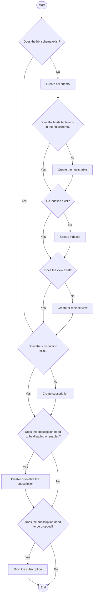

# replication_subscriber
Example setup for a replication subscriber using a ClowdJobInvocation. With this tool you can create a job run to setup your subscription, or if necessary alert (enable/disable) your subscription or drop the subscription if you are troubleshooting a replication issue.

## Job flow
The diagram below describes the steps the job takes during execution.


- The "Alter Subscripiton" logic only runs if the `ALTER_SUBSCRIPTION` parameter is provided `ENABLE` or `DISABLE` (other values will cause an error).
- The "Drop Subscription" logic only runs if the `DROP_SUBSCRIPTION` parameter is provided with a "truthy" value.

## Ephemeral Execution
1. Namespace reservation
```
bonfire namespace reserve -d 24h
```

2. Deploy application
```
bonfire deploy <your-app> --ref-env insights-stage
```

3. Specify your application specific parameters to trigger the execution:
```
oc process -f ./replication_subscriber/deploy/replication-subscription-runner-cji.yml --param=DB_NAME=<your-app-db> --param=DEPENDENT_APP_NAME=<your-app-name> --param=HBI_SUBSCRIPTION=<your-app>_hosts_sub --param=ENV_NAME=<environment-name> REPLICATION_SUBSCRIPTION_RUN_NUMBER="1" | oc apply -f -
```
